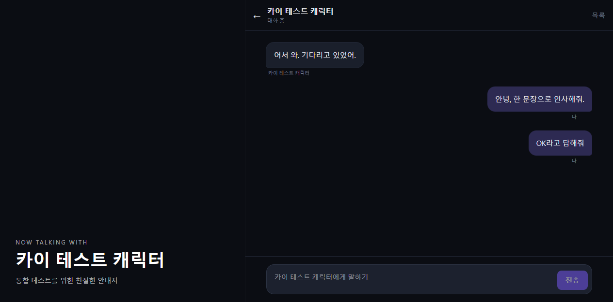

# RisuAI-KAI

RisuAI-KAI는 여러 AI 모델(OpenAI, Claude, Gemini 등)을 하나의 인터페이스에서 사용할 수 있는 크로스플랫폼 AI 채팅 애플리케이션입니다.

<p align="center">
  
</p>

- Frontend: Svelte 5 + TypeScript
- Desktop: Tauri 2.5 (Rust)
- Build Tool: Vite 8
- Styling: Tailwind CSS 4
- Package Manager: pnpm

## 주요 기능

- 다중 AI 제공자 통합 채팅
- 테마/커스터마이징 UI
- 플러그인 시스템(API v3.0)
- 캐릭터 카드 import/export
- 메모리/로어북 기반 컨텍스트 확장
- 웹/데스크톱(Tauri)/셀프호스팅 서버 지원

## 요구 사항

- Node.js: `^20.19.0` 또는 `>=22.12.0`
- pnpm: `10.x` 권장
- (선택) Tauri 개발 시 Rust/Cargo

## 빠른 시작

```bash
pnpm install
pnpm dev
```

웹 개발 서버가 실행됩니다.

## 스크립트

루트 `package.json` 기준:

```bash
# 개발
pnpm dev

# 타입 체크
pnpm check

# 테스트
pnpm test

# 웹 빌드 (sourcemap 포함)
pnpm build

# 호스팅용 빌드(dist)
pnpm buildsite

# Tauri 관련
pnpm tauri dev
pnpm tauribuild
pnpm tauri build

# 기존 Node 서버 실행
pnpm runserver

# Hono 서버 번들 빌드
pnpm hono:build
```

## 서버 구성

### 1) Node 서버 (`server/node`)

기존 셀프호스팅 서버 구현입니다.

- 문서: `server/node/readme.md`
- 실행: 루트에서 `pnpm runserver`

### 2) Hono 서버 (`server/hono`)

차세대 서버 구현(개발 중)입니다.

- 문서: `server/hono/README.md`
- 빌드: 루트에서 `pnpm hono:build`

### 3) KAI 서버 (`kai/server`)

독립적인 TypeScript/Hono 기반 서버 패키지입니다.

```bash
cd kai/server
pnpm install
pnpm dev
```

주요 스크립트:

- `pnpm dev`: 개발 서버
- `pnpm build`: 빌드
- `pnpm start`: 실행
- `pnpm db:generate`: Drizzle 마이그레이션 생성
- `pnpm db:push`: DB 스키마 반영

## 프로젝트 구조

```text
src/             메인 앱 소스 (Svelte + TS)
src/ts/          비즈니스 로직 (process, model, plugin 등)
src/lib/         UI 컴포넌트
src/lang/        다국어 리소스
src-tauri/       Tauri(Rust) 백엔드
server/node/     기존 Node 셀프호스팅 서버
server/hono/     Hono 기반 서버(개발 중)
kai/server/      KAI 전용 서버 패키지
public/          정적 리소스
```

## 개발 가이드

- 코드 스타일은 기존 포맷팅 규칙(Prettier/프로젝트 컨벤션)을 따릅니다.
- PR 전 아래 명령 실행을 권장합니다.

```bash
pnpm check
pnpm test
```

- 테마 관련 작업 시 `src/styles.css`의 커스텀 컬러 토큰을 우선 사용하세요.

## 문서

- 플러그인 가이드: `plugins.md`
- 서버 문서: `server/node/readme.md`, `server/hono/README.md`
- 프로젝트 안내: `AGENTS.md`

## 라이선스

저장소의 `LICENSE` 파일을 참고하세요.
